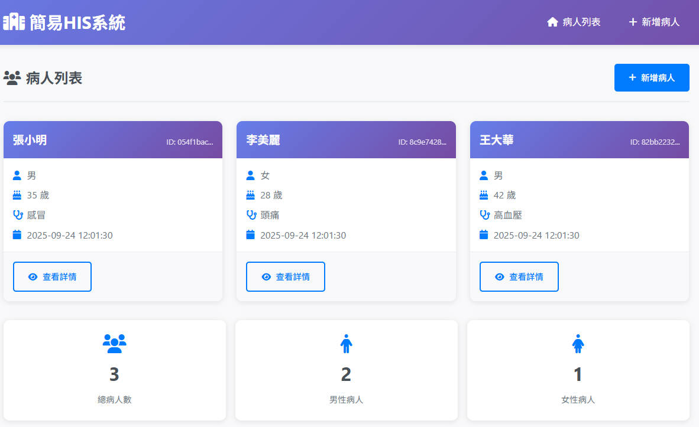

# 簡易HIS系統 (Hospital Information System)

這是一個基於Python Flask開發的簡易醫院信息系統Demo網站，用於演示病人基本資料的管理功能。




## 功能特色

- ✅ **病人列表瀏覽** - 顯示所有病人基本資訊
- ✅ **新增病人** - 完整的病人資料輸入表單
- ✅ **病人詳情查看** - 詳細的病人資訊展示
- ✅ **響應式設計** - 支援桌面和行動裝置
- ✅ **現代化UI** - 美觀的使用者介面設計
- ✅ **資料驗證** - 完整的表單驗證機制
- ✅ **錯誤處理** - 友善的錯誤提示頁面

## 技術規格

- **後端框架**: Python Flask 2.3.3
- **前端技術**: HTML5, CSS3, JavaScript
- **資料儲存**: 記憶體清單（模擬資料庫）
- **Python版本**: 3.8+
- **圖示庫**: Font Awesome 6.0.0

## 快速開始

### 1. 環境準備

確保您的系統已安裝Python 3.8或更高版本：

```bash
python --version
```

### 2. 安裝依賴

```bash
pip install -r requirements.txt
```

### 3. 啟動應用程式

```bash
python app.py
```

或者使用Flask命令：

```bash
flask run
```

### 4. 訪問網站

開啟瀏覽器，前往：http://localhost:5000

## 專案結構

```
VibeCodingHIS/
├── app.py                 # Flask應用程式主檔案
├── requirements.txt       # Python依賴套件清單
├── README.md             # 專案說明文件
├── PRD.md                # 產品需求說明書
├── templates/            # HTML模板檔案
│   ├── base.html         # 基礎模板
│   ├── index.html        # 病人列表頁
│   ├── add_patient.html  # 新增病人頁
│   ├── patient_detail.html # 病人詳情頁
│   └── error.html        # 錯誤頁面
└── static/               # 靜態資源檔案
    └── style.css         # CSS樣式檔案
```

## 功能說明

### 病人列表頁（首頁）
- 顯示所有病人的基本資訊
- 包含姓名、性別、年齡、診斷說明
- 支援點擊進入詳細資料頁
- 提供統計資訊（總病人數、性別分佈）

### 新增病人頁
- **必填欄位**：姓名、年齡、性別
- **選填欄位**：診斷說明
- **資料驗證**：年齡範圍檢查、必填欄位驗證
- **使用者友善**：即時錯誤提示、表單狀態保持

### 病人詳情頁
- 完整顯示病人所有資訊
- 包含系統資訊（病人ID、建立時間）
- 支援複製病人ID功能
- 錯誤處理（病人不存在時顯示錯誤頁面）

## 資料結構

每個病人記錄包含以下欄位：

```python
{
    'id': '唯一識別碼',
    'name': '病人姓名',
    'age': '年齡',
    'gender': '性別（男/女/其他）',
    'diagnosis': '診斷說明',
    'created_at': '建立時間'
}
```

## 預設資料

系統啟動時會自動建立3筆範例病人資料：

1. **張小明** - 35歲男性，診斷：感冒
2. **李美麗** - 28歲女性，診斷：頭痛  
3. **王大華** - 42歲男性，診斷：高血壓

## 開發說明

### 本地開發

1. 克隆專案到本地
2. 建立虛擬環境（建議）：
   ```bash
   python -m venv venv
   source venv/bin/activate  # Windows: venv\Scripts\activate
   ```
3. 安裝依賴：`pip install -r requirements.txt`
4. 啟動開發伺服器：`python app.py`

### 自訂設定

在 `app.py` 中可以調整以下設定：

- `app.secret_key` - Flask session密鑰
- `app.run()` 參數 - 主機位址和埠號
- 預設病人資料

## 擴展功能建議

未來可以考慮加入以下功能：

- [ ] 病人資料編輯與刪除
- [ ] 實際資料庫整合（MySQL、SQLite）
- [ ] 使用者登入與權限管理
- [ ] 醫護人員管理系統
- [ ] 排班管理功能
- [ ] 醫囑管理系統
- [ ] 報表產生功能
- [ ] API介面開發

## 注意事項

- 本系統僅供演示使用，不適合生產環境
- 資料儲存在記憶體中，重啟後會重置
- 未包含資料備份與復原機制
- 無使用者認證與權限控制

## 授權

本專案僅供學習和演示使用。

## 聯絡資訊

如有問題或建議，歡迎提出Issue或Pull Request。

---

**版本**: 1.0.0  
**最後更新**: 2024年9月